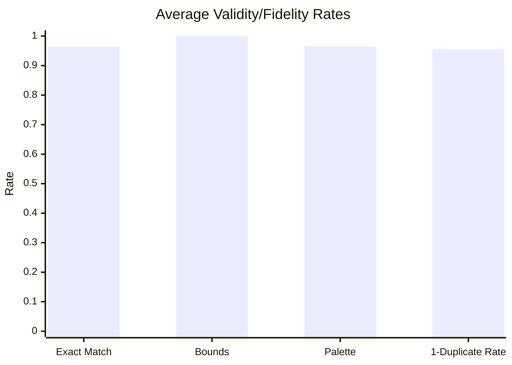

# Evaluation Aggregate Summary

- Files analyzed: **20**
- Total operations: **3445**
- Total expected blocks: **3030**
- Total recovered blocks: **2889**

## Average Key Metrics

| Metric | Average |
|---|---:|
| Exact match rate | 0.9653 |
| Bounds validity | 1 |
| Palette validity | 0.9658 |
| Duplicate coordinate rate | 0.0447 |
| Total operations | 172.25 |
| Expected block count | 151.5 |
| Recovered block count | 144.45 |
| Missing block count | 7.05 |
| Extra block count | 0 |
| Block type mismatch count | 0 |

## Average Rate Chart

## Top 5 Exact Match Rates

| Prompt | Exact Match Rate |
|---|---:|
| Construct a gothic cathe... | 1 |
| Build a windmill with a ... | 1 |
| Make a desert sandstone ... | 1 |
| Design a terraced garden... | 1 |
| Design a grand staircase... | 1 |

## Bottom 5 Exact Match Rates

| Prompt | Exact Match Rate |
|---|---:|
| Build a greenhouse made ... | 0.6724 |
| Construct an underground... | 0.7917 |
| Construct a stone bridge... | 0.9487 |
| Create a small castle ga... | 0.9541 |
| Create a compact blacksm... | 0.9879 |

